# OT-SHMPCC Complete Reference

**Optimal Transport Safe-Horizon Model Predictive Contouring Control**

Comprehensive reference for the codebase: architecture, module analysis with expandable diagrams, file-level API reference, mathematical formulations with code verification, experiment coverage, and Python reference comparison.

---

## Table of Contents

1. [System Overview](#1-system-overview)
2. [Data Flow Pipeline](#2-data-flow-pipeline)
3. [Module Analysis](#3-module-analysis)
   - [3.1 Types & Config](#31-types--config)
   - [3.2 Ego Dynamics](#32-ego-dynamics)
   - [3.3 Mode Weights](#33-mode-weights)
   - [3.4 Scenario Sampling](#34-scenario-sampling)
   - [3.5 Optimal Transport Predictor](#35-optimal-transport-predictor)
   - [3.6 Wasserstein DRO](#36-wasserstein-dro)
   - [3.7 DRO vs OT: Architectural Relationship](#37-dro-vs-ot-architectural-relationship)
   - [3.8 Collision Constraints](#38-collision-constraints)
   - [3.9 Scenario Pruning](#39-scenario-pruning)
   - [3.10 Reference Path & MPCC](#310-reference-path--mpcc)
   - [3.11 QP Solver (ADMM)](#311-qp-solver-admm)
   - [3.12 MPC Controller](#312-mpc-controller)
   - [3.13 Experiment Infrastructure](#313-experiment-infrastructure)
4. [File Reference](#4-file-reference)
   - [4.1 Headers](#41-headers)
   - [4.2 Sources](#42-sources)
   - [4.3 Tests](#43-tests)
5. [Control Flow: Single MPC Solve](#5-control-flow-single-mpc-solve)
6. [Mathematical Formulations & Verification](#6-mathematical-formulations--verification)
7. [Integration Matrix](#7-integration-matrix)
8. [Experiment Coverage](#8-experiment-coverage)
9. [Python Reference Comparison (PyMPC)](#9-python-reference-comparison-pympc)
10. [Build & Execution](#10-build--execution)

---

## 1. System Overview

The system implements a **scenario-based Model Predictive Contouring Controller** for an ego vehicle navigating among multi-modal obstacles. It combines three key innovations:

- **Optimal Transport (OT)**: Uses Sinkhorn-regularized Wasserstein distances to learn obstacle behavior distributions and compute mode weights
- **Safe Horizon (SH)**: Truncates the constraint horizon to $N_{\text{safe}}$ steps where probabilistic guarantees hold (Theorem 1)
- **Distributionally Robust Optimization (DRO)**: Reweights mode probabilities to the worst-case distribution $Q^*$ within a Wasserstein ball around the nominal $\hat{P}$

At each timestep the controller:

1. **Samples** obstacle trajectory scenarios from learned mode distributions
2. **Prunes** dominated scenarios (Algorithm 3)
3. **Linearizes** collision constraints around a reference trajectory (Section 7)
4. **Truncates** the constraint horizon to a safe horizon N_safe (Theorem 1)
5. **Solves** a condensed QP via SQP+ADMM with MPCC contouring cost (Eq. 6), with MPCC costs limited to N_mpcc = min(cost_horizon, N) when safe horizon is active
6. **Removes** inactive scenarios (Algorithm 4)
7. **Applies** the first control input

**Reference Path**: All experiments use an S-curve reference path (`y = A*sin(2*pi*x/L)`, L=25m, A=3m) for MPCC contouring/lag tracking. Rollouts terminate when ego reaches 95% of path arc length (path completion).

<details>
<summary><b>Click to expand: High-Level Architecture Diagram</b></summary>

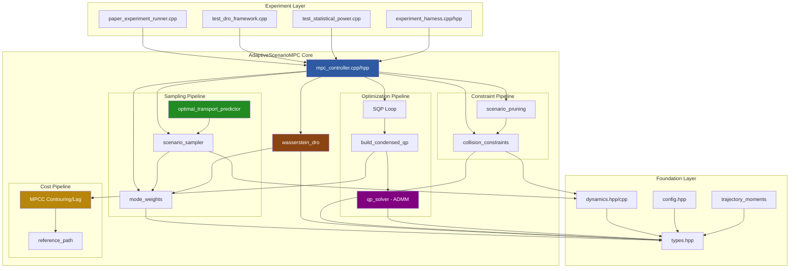

</details>

**Dependency graph** (header include order):

```
types.hpp <---- config.hpp
    |               |
    v               v
dynamics.hpp    mode_weights.hpp
    |               |
    v               v
scenario_sampler.hpp <-- trajectory_moments.hpp
    |
    v
collision_constraints.hpp
    |
    v
scenario_pruning.hpp
    |
    v
qp_solver.hpp
    |
    v
wasserstein_dro.hpp
    |
    v
mpc_controller.hpp <-- reference_path.hpp
    |
    v
experiment_harness.hpp <-- optimal_transport_predictor.hpp
```

---

## 2. Data Flow Pipeline

The MPC solve executes a 7-step pipeline at each control timestep.

<details>
<summary><b>Click to expand: Complete MPC Solve Pipeline</b></summary>

```mermaid
flowchart TD
    START([solve called]) --> INIT[Initialize Reference Trajectory]
    INIT --> |warmstart from previous or straight-line| WEIGHTS

    subgraph Step2["Step 2: Sample Scenarios"]
        WEIGHTS[Compute Mode Weights<br/>mode_weights.cpp]
        WEIGHTS --> DROCHECK{DRO Enabled?}
        DROCHECK -->|Yes| DROCOMP[Compute Q* via<br/>Kantorovich Dual<br/>wasserstein_dro.cpp]
        DROCOMP --> DROSAMPLE[Sample from Q*<br/>scenario_sampler.cpp]
        DROCHECK -->|No| COVCHECK{Mode Coverage?}
        COVCHECK -->|Yes| COVSAMPLE[Sample with Coverage<br/>Phase 1: one per mode<br/>Phase 2: fill remainder]
        COVCHECK -->|No| STDSAMPLE[Standard Sampling<br/>Categorical from weights]
    end

    DROSAMPLE --> PRUNE
    COVSAMPLE --> PRUNE
    STDSAMPLE --> PRUNE

    subgraph Step3["Step 3: Prune & Verify"]
        PRUNE[Prune Dominated Scenarios<br/>Algorithm 3]
        PRUNE --> VERIFY{S >= S_required?}
        VERIFY -->|No, enforce| ADDSAMPLE[Sample Additional]
        ADDSAMPLE --> CONSTRAIN
        VERIFY -->|Yes| CONSTRAIN
    end

    subgraph Step4["Step 4: Linearize Constraints"]
        CONSTRAIN[Compute Linearized<br/>Collision Constraints<br/>Eqs. 17-18, Multi-disc D=3]
        CONSTRAIN --> SHCHECK{Safe Horizon?}
        SHCHECK -->|Yes| SHTRUNC[Truncate to N_safe<br/>Filter constraints k > N_safe]
        SHCHECK -->|No| FULLH[Use full horizon N]
    end

    SHTRUNC --> OPT
    FULLH --> OPT

    subgraph Step5["Step 5: Solve Optimization"]
        OPT{SQP Solver?}
        OPT -->|Yes| SQPLOOP[SQP Loop max 5 iter]
        SQPLOOP --> BUILDQP[build_condensed_qp<br/>Condense dynamics<br/>Build H, g, C, d]
        BUILDQP --> ADMM[ADMM Solve<br/>qp_solver.cpp]
        ADMM --> LINESEARCH[Line Search<br/>full/half/quarter]
        LINESEARCH --> CONVCHECK{Converged?}
        CONVCHECK -->|No| SQPLOOP
        CONVCHECK -->|Yes| FEASCHECK
        OPT -->|No| HEURISTIC[Heuristic Fallback<br/>Straight-line + avoidance]
    end

    subgraph Step6["Step 6: Post-Process"]
        FEASCHECK{Feasible?}
        FEASCHECK -->|No| FALLBACK[Safe Fallback<br/>Emergency braking]
        FEASCHECK -->|Yes| INACTIVE[Remove Inactive Scenarios<br/>Algorithm 4]
        FALLBACK --> RESULT
        INACTIVE --> RESULT([Return MPCResult])
    end

    style Step2 fill:#1a3a1a,color:#fff
    style Step3 fill:#1a1a3a,color:#fff
    style Step4 fill:#3a1a1a,color:#fff
    style Step5 fill:#2a2a0a,color:#fff
    style Step6 fill:#1a2a3a,color:#fff
```

</details>

<details>
<summary><b>Click to expand: Data Type Flow Between Steps</b></summary>

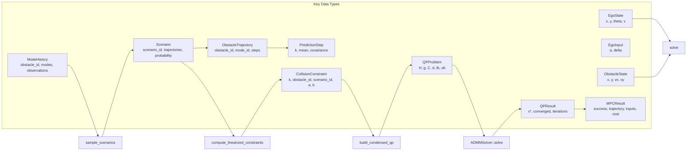

</details>

---

## 3. Module Analysis

### 3.1 Types & Config

**Files**: [`include/types.hpp`](../include/types.hpp), [`include/config.hpp`](../include/config.hpp)

The type system defines the complete data model. Every struct maps directly to a paper concept.

<details>
<summary><b>Click to expand: Type Hierarchy Diagram</b></summary>

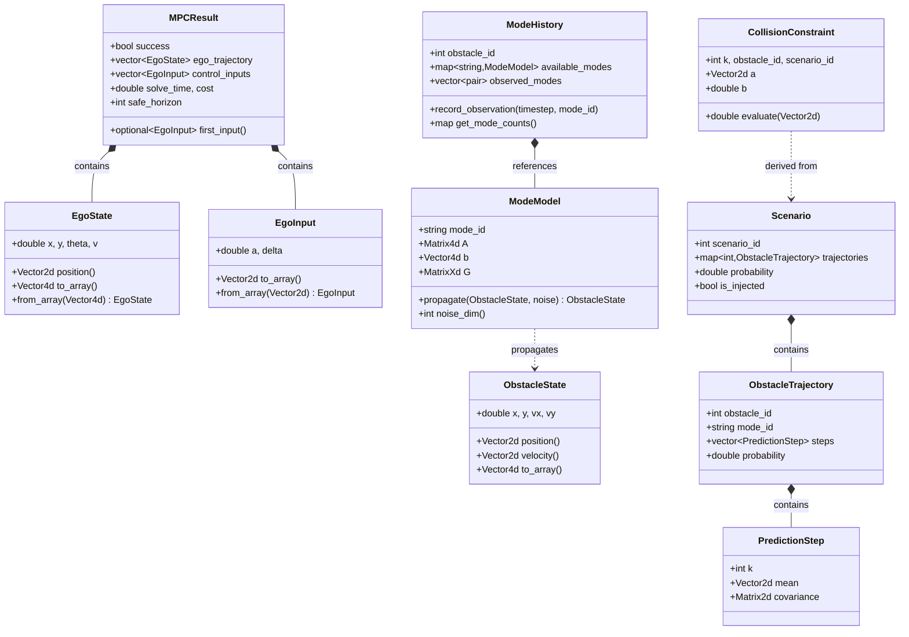

</details>

**Type reference** ([`types.hpp`](../include/types.hpp)):

| Struct/Enum | Line | Description |
|---|---|---|
| `EgoState` | 32 | Ego state `(x, y, theta, v)` with `position()`, `to_array()` helpers |
| `EgoInput` | 61 | Control input `(a, delta)` -- acceleration and steering rate |
| `ObstacleState` | 82 | Obstacle state `(x, y, vx, vy)` with `position()`, `velocity()` |
| `ModeModel` | 123 | Linear dynamics `x_{k+1} = A*x_k + b + G*w_k` for each behavior mode |
| `ModeHistory` | 162 | Observation log `{(timestep, mode_id)}` per obstacle |
| `PredictionStep` | 212 | Single timestep prediction: mean position + covariance |
| `ObstacleTrajectory` | 226 | Full horizon prediction for one obstacle under one mode |
| `Scenario` | 258 | Joint scenario: `{obstacle_id -> ObstacleTrajectory}` + probability |
| `TrajectoryMoments` | 284 | First+second moments of obstacle trajectory distribution |
| `WeightType` | 314 | Enum: `UNIFORM`, `RECENCY`, `FREQUENCY`, `WASSERSTEIN`, `TEMPERATURE`, `EPSILON_GREEDY` |
| `CollisionConstraint` | 328 | Linearized half-plane `a^T*p >= b` at timestep k |
| `MPCResult` | 354 | Optimization output: trajectory, inputs, cost, solve_time, safe_horizon |

**Config** (`ScenarioMPCConfig`) centralizes all hyperparameters with mathematical significance:

| Parameter Group | Key Fields | Paper Reference |
|---|---|---|
| Horizon | `horizon=20`, `dt=0.1` | Section 2 |
| Ego Limits | `max_acceleration=3.0`, `max_steering_rate=0.8` | Eq. 1 |
| Scenario | `num_scenarios=10`, `confidence_level=0.95`, `beta=0.01` | Theorem 1 |
| DRO | `enable_dro`, `dro_epsilon_base=0.1`, `dro_risk_sigma_scale=1.0` | Section 6 |
| Safe Horizon | `safe_horizon_enabled`, `safe_horizon_min=12`, `safe_horizon_mode=PRACTICAL` | Theorem 1 |
| MPCC | `contour_weight=1.0`, `lag_weight=0.1`, `terminal_heading_weight=1.0` | Eq. 6 |
| Solver | `sqp_max_iterations=5`, `qp_max_iterations=200` | Section 7 |

Three safe horizon computation modes:
- **PRACTICAL**: $N_{\text{safe}} = \min\!\big(N,\; \lfloor S/(2n_u)\rfloor\big)$
- **THEORETICAL_SIMPLE**: Largest $N_{\text{safe}}$ s.t. $S \geq \frac{2}{\varepsilon}\!\left(\ln\frac{1}{\beta} + N_{\text{safe}} \cdot n_u\right)$
- **THEORETICAL_TIGHT**: Uses Eq. 25 tight bound

**Key config methods**:
- [`compute_required_scenarios(d, R)`](../include/config.hpp) (line 141) -- Theorem 1: `S >= (2/eps)(ln(1/beta) + d + R)`
- [`compute_required_scenarios_tight(nbar)`](../include/config.hpp) (line 158) -- Tight bound (Eq. 25)
- [`compute_safe_horizon(S, n_u)`](../include/config.hpp) (line 189) -- Finds largest N_safe satisfying the bound

---

### 3.2 Ego Dynamics

**Files**: [`include/dynamics.hpp`](../include/dynamics.hpp), [`src/dynamics.cpp`](../src/dynamics.cpp)

Implements the unicycle model with RK4 integration.

**Continuous dynamics** (Section 2):

$$\dot{x} = \begin{bmatrix} v\cos\theta \\ v\sin\theta \\ \omega \\ a \end{bmatrix}, \quad u = \begin{bmatrix} a \\ \omega \end{bmatrix}$$

**Discrete dynamics**: 4th-order Runge-Kutta with step size `dt`.

**Jacobian computation**: Finite differences of the discrete dynamics for SQP linearization:

$$A_k = \frac{\partial f_d}{\partial x}\bigg|_{(x_k, u_k)}, \quad B_k = \frac{\partial f_d}{\partial u}\bigg|_{(x_k, u_k)}$$

<details>
<summary><b>Click to expand: Dynamics Integration Flow</b></summary>

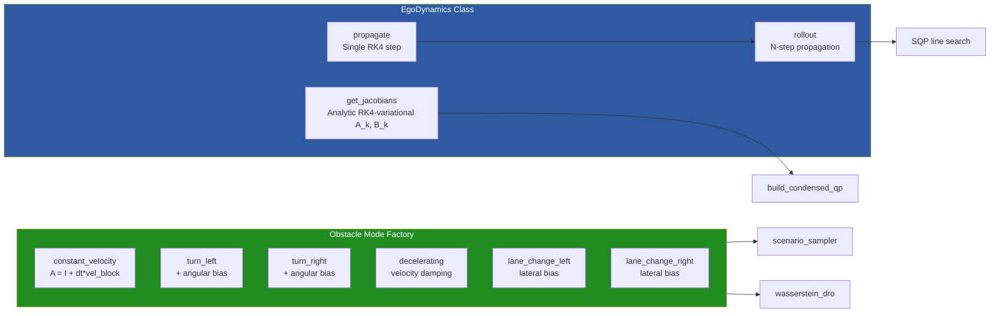

</details>

**Obstacle mode models** (6 standard modes):

| Mode | $A$ modification | $b$ bias | Description |
|---|---|---|---|
| `constant_velocity` | Identity + velocity propagation | Zero | Straight-line motion |
| `turn_left` | + angular velocity coupling | Left turn bias | Curved left trajectory |
| `turn_right` | + angular velocity coupling | Right turn bias | Curved right trajectory |
| `decelerating` | Velocity damping factor | Zero | Slowing down |
| `lane_change_left` | Standard | Lateral velocity bias | Lane change left |
| `lane_change_right` | Standard | Lateral velocity bias | Lane change right |

All modes use process noise matrix $G$ with scaling factor 0.5 matching the Python reference.

| Function | Description |
|---|---|
| `propagate(state, input)` | RK4 integration over dt |
| `rollout(initial, inputs)` | Propagate N steps, returns N+1 states |
| `get_jacobians(state, input)` | Returns `(A_k, B_k)` for SQP linearization; exact derivative of the RK4 map (variational equations), not Euler |
| `create_obstacle_mode_models(dt)` | Factory: creates all 6 standard modes |

---

### 3.3 Mode Weights

**Files**: [`include/mode_weights.hpp`](../include/mode_weights.hpp), [`src/mode_weights.cpp`](../src/mode_weights.cpp)

Computes probability weights $w_m$ for each behavior mode from observation history.

**Weight strategies**:

| Strategy | Formula | Use Case |
|---|---|---|
| UNIFORM | $w_m = 1/M$ | Baseline, no learning |
| FREQUENCY | $w_m = \text{count}_m / \text{total}$ | Count-based |
| RECENCY | $w_m \propto \sum_t \lambda^{T-t} \cdot \mathbb{1}[\text{mode}_t = m]$ | Time-weighted |
| WASSERSTEIN | $0.3 \cdot w_\text{freq} + 0.7 \cdot w_\text{recency}$ | Blended |
| TEMPERATURE | $w'_m = \exp(\ln w_m / T)$, $T=0.5$ | Sharpened |
| EPSILON_GREEDY | $w'_m = (1-\varepsilon)w_m + \varepsilon/M$, $\varepsilon=0.3$ | Exploration |

**Critical behavior**:

1. **Observation gate**: After computing raw weights, modes with zero observation count are forced to weight 0. Unobserved modes are never sampled.
2. **Cold-start**: When no modes observed at all, returns empty map. Callers generate stationary trajectories.

<details>
<summary><b>Click to expand: Mode Weight Computation Flow</b></summary>

```mermaid
flowchart TD
    INPUT[ModeHistory<br/>observed_modes list] --> SWITCH{WeightType}

    SWITCH -->|UNIFORM| UNI[w_m = 1/M for all modes]
    SWITCH -->|FREQUENCY| FREQ[Count observations per mode<br/>w_m = count_m / total]
    SWITCH -->|RECENCY| REC[Exponential decay<br/>w_m = sum lambda^T-t * 1{mode=m}]
    SWITCH -->|WASSERSTEIN| WASS[0.3*freq + 0.7*recency]
    SWITCH -->|TEMPERATURE| TEMP[Sharpen: exp{log w_m / T}]
    SWITCH -->|EPSILON_GREEDY| EPS["(1-eps)*w_m + eps/M"]

    UNI --> GATE
    FREQ --> GATE
    REC --> GATE
    WASS --> GATE
    TEMP --> GATE
    EPS --> GATE

    GATE[Observation Gate<br/>Zero out unobserved modes]
    GATE --> EMPTY{All weights zero?}
    EMPTY -->|Yes| COLD[Return empty map<br/>Cold start: stationary fallback]
    EMPTY -->|No| NORM[Normalize to sum = 1]
    NORM --> OUTPUT[weights: map string->double]

    style GATE fill:#b22222,color:#fff
    style COLD fill:#8b4513,color:#fff
```

</details>

| Function | Description |
|---|---|
| `compute_mode_weights(history, type, decay, t)` | Returns `{mode_id -> weight}` normalized to sum 1 |
| `sample_mode_from_weights(weights, rng)` | Categorical sampling |
| `compute_mode_transition_matrix(history, modes)` | Estimate `P[i,j] = P(mode_j | mode_i)` |

---

### 3.4 Scenario Sampling

**Files**: [`include/scenario_sampler.hpp`](../include/scenario_sampler.hpp), [`src/scenario_sampler.cpp`](../src/scenario_sampler.cpp)

Implements Algorithm 1: `SampleScenarios`. Generates $S$ joint obstacle trajectory scenarios.

**Sampling methods**:

| Function | Strategy |
|---|---|
| `sample_scenarios` | Standard weighted categorical sampling |
| `sample_scenarios_with_mode_coverage` | Phase 1: one scenario per mode; Phase 2: fill remainder from weights |
| `sample_scenarios_with_weights` | Use externally provided weights (DRO $q^*$) |
| `sample_scenarios_stratified` | Allocate $\lfloor S \cdot w_m \rfloor$ per mode |
| `sample_scenarios_with_mode_sequences` | Sample mode sequences for multi-step consistency |

**Trajectory generation**: For each scenario, per obstacle:
1. Sample mode $m \sim \text{Categorical}(w)$
2. For $k = 0, \ldots, N-1$: draw noise $w_k \sim \mathcal{N}(0, I)$, propagate $x_{k+1} = A_m x_k + b_m + G_m w_k$
3. Record `PredictionStep` with mean position and growing covariance

**Stationary fallback**: `make_stationary_trajectory()` generates a hold-position trajectory for obstacles with no observed modes. Position stays constant, covariance grows at rate $\sigma_\text{growth} = 0.01$ per step.

<details>
<summary><b>Click to expand: Scenario Sampling Pipeline</b></summary>

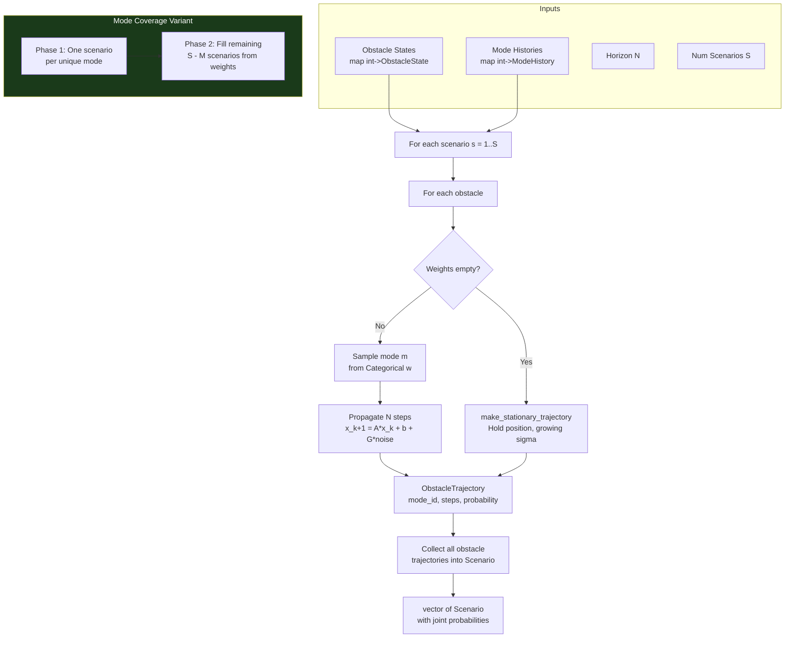

</details>

---

### 3.5 Optimal Transport Predictor

**Files**: [`include/optimal_transport_predictor.hpp`](../include/optimal_transport_predictor.hpp), [`src/optimal_transport_predictor.cpp`](../src/optimal_transport_predictor.cpp)

OT-based obstacle dynamics learning using Sinkhorn algorithm and Wasserstein barycenters.

**Core algorithms**:

1. **Sinkhorn-Knopp** (Cuturi 2013): Solves entropy-regularized OT

$$\min_P \langle C, P \rangle + \varepsilon H(P) \quad \text{s.t.} \quad P\mathbf{1} = a, \; P^\top\mathbf{1} = b$$

   via alternating row/column normalizations of the Gibbs kernel $K = \exp(-C/\varepsilon)$.

2. **Wasserstein distance**: $W_p(\mu, \nu) = \left(\inf_P \sum_{i,j} C_{ij} P_{ij}\right)^{1/p}$

3. **Wasserstein barycenter** (Cuturi & Doucet 2014): $\arg\min_\nu \sum_i w_i W_2(\mu_i, \nu)^2$

**Ground cost types** (7 options for ablation):

| Type | Formula | Purpose |
|---|---|---|
| `SQUARED_EUCLIDEAN` | $\|v_i - v_j\|^2$ | Default, full W2 geometry |
| `MANHATTAN` | $\|v_i - v_j\|_1$ | L1 alternative |
| `FLAT` | $C_{ij} = 1$ for all $i \neq j$ | No spatial geometry |
| `MEAN_ONLY` | $\|\bar{\mu}_1 - \bar{\mu}_2\|$ | Bypass OT |
| `DIRECTIONAL` | $1 - \cos(v_i, v_j)$ | Angular similarity |
| `RANDOM_PERMUTED` | Permuted W2 matrix | Breaks semantic alignment |
| `CONSTANT` | $C_{ij} = c$ | Degenerate |

<details>
<summary><b>Click to expand: OT Predictor Architecture</b></summary>

```mermaid
flowchart TD
    subgraph Observation["Observation Pipeline"]
        OBS_IN[observe obstacle_id, position] --> VEL_COMP[Compute velocity<br/>from consecutive positions]
        VEL_COMP --> ACC_COMP[Compute acceleration<br/>from consecutive velocities]
        ACC_COMP --> BUF[TrajectoryBuffer<br/>circular deque, max 200]
        BUF --> MODE_DIST[Update ModeDistribution<br/>per obstacle, per mode]
    end

    subgraph WeightComputation["Mode Weight Computation"]
        MODE_DIST --> ENOUGH{>= min_samples?}
        ENOUGH -->|Yes| OT_DIST[Compute Wasserstein distance<br/>observed vs reference per mode]
        ENOUGH -->|No| UNIFORM_W[Uniform weights]
        OT_DIST --> INV_W[Inverse distance weights<br/>w_m = 1/max{W_m, eps}]
        INV_W --> NORM_W[Normalize to sum = 1]
    end

    subgraph Prediction["Trajectory Prediction"]
        NORM_W --> PRED_PER_MODE[Predict per mode<br/>constant velocity + learned bias]
        PRED_PER_MODE --> BARY[Wasserstein Barycenter<br/>Bregman projection]
        BARY --> COMBINED[Combined OTPredictionStep<br/>position + uncertainty ellipse]
    end

    subgraph DynamicsLearning["Dynamics Learning"]
        BUF --> RESID[Compute residuals<br/>r_k = x_k+1 - A_prior * x_k]
        RESID --> LEARN_B[b_learned = mean of r]
        RESID --> LEARN_G["G_learned = chol(cov(r) + reg*I)"]
    end

    subgraph SinkhornCore["Sinkhorn Algorithm"]
        COST[compute_cost_matrix<br/>N x M pairwise costs]
        COST --> GIBBS["K = exp(-C / epsilon)"]
        GIBBS --> SINKHORN_ITER["Alternating normalization<br/>u = a ./ (K * v)<br/>v = b ./ (K^T * u)"]
        SINKHORN_ITER --> TRANSPORT["P = diag(u) * K * diag(v)"]
        TRANSPORT --> W_DIST["distance = sum(C .* P)"]
    end

    OT_DIST --> SinkhornCore

    style SinkhornCore fill:#228b22,color:#fff
    style DynamicsLearning fill:#8b4513,color:#fff
```

</details>

**Key classes**:

| Class | Purpose |
|---|---|
| `TrajectoryObservation` | Single observation: position, velocity, acceleration, mode label |
| `TrajectoryBuffer` | Circular deque (max 200) per obstacle |
| `EmpiricalDistribution` | Weighted sample set with mean/covariance |
| `ModeDistribution` | Per-mode velocity and acceleration distributions |
| `OptimalTransportPredictor` | Full predictor: observe, learn, weight, predict |

| Function | Description |
|---|---|
| `compute_cost_matrix(source, target, p, cost_type)` | Pairwise cost `C[i,j]` with multiple ground cost options |
| `sinkhorn_algorithm(a, b, C, eps, max_iter)` | Entropy-regularized OT: `min_P <C,P> + eps*H(P)` |
| `wasserstein_distance(source, target, eps, p)` | W_p distance via Sinkhorn |
| `wasserstein_barycenter(distributions, weights, n)` | Bregman projection barycenter |

---

### 3.6 Wasserstein DRO

**Files**: [`include/wasserstein_dro.hpp`](../include/wasserstein_dro.hpp), [`src/wasserstein_dro.cpp`](../src/wasserstein_dro.cpp)

Computes worst-case mode weights $Q^*$ within a Wasserstein ball around the nominal distribution $\hat{P}$.

**Kantorovich dual** (Section 6):

$$\sup_{Q \in \mathcal{B}_\varepsilon(\hat{P})} \sum_m q_m r_m = \inf_{\lambda \geq 0} \left\{ \lambda\varepsilon + \sum_i w_i \max_j\!\left(r_j - \lambda D_{ij}\right) \right\}$$

Solved via binary search on $\lambda$. Recovery:

$$Q^*[j] = \sum_i w_i \cdot \mathbb{1}\!\left\{j = \arg\max_j\!\left(r_j - \lambda^* D_{ij}\right)\right\}$$

<details>
<summary><b>Click to expand: DRO Computation Pipeline</b></summary>

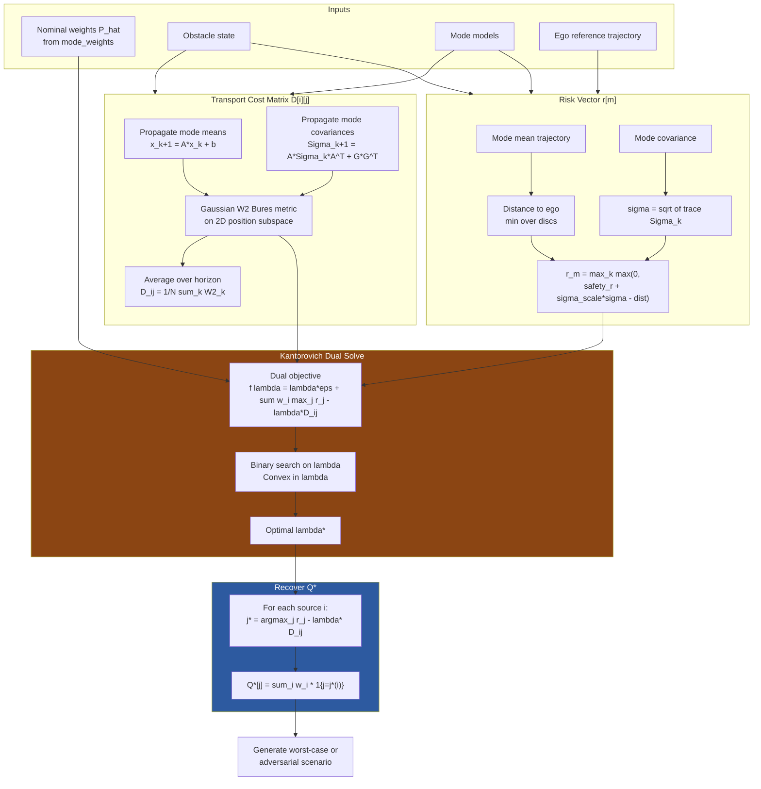

</details>

**W2 Bures metric** for Gaussian measures on $\mathbb{R}^2$:

$$W_2^2(\mathcal{N}(\mu_1, \Sigma_1), \mathcal{N}(\mu_2, \Sigma_2)) = \|\mu_1 - \mu_2\|^2 + \text{tr}\!\left(\Sigma_1 + \Sigma_2 - 2\left(\Sigma_1^{1/2}\Sigma_2\Sigma_1^{1/2}\right)^{1/2}\right)$$

Implemented with a closed-form $2\times 2$ matrix square root.

**Adaptive epsilon**:

$$\varepsilon = \text{clamp}\!\left(\varepsilon_\text{base} \cdot \frac{\alpha}{\sqrt{n_\text{obs}}} + \gamma \cdot H(\hat{P}),\; \varepsilon_\text{min},\; \varepsilon_\text{max}\right)$$

where $H(\hat{P})$ is the entropy of the nominal distribution and $n_\text{obs}$ is the observation count.

**Scenario generation modes**:

| Mode | Method | Description |
|---|---|---|
| `DRO` | `generate_worst_case_scenario` | Deterministic rollout of $m^* = \arg\max_m Q^*_m$ |
| `ADVERSARIAL` | `generate_adversarial_scenario` | Push trajectory $\sigma$-sigma toward ego along approach direction |
| `RANDOM` | Random mode injection | One random mode per step |
| `ALL_MODES` | Inject all modes | Deterministic all-mode coverage |

| Function | Description |
|---|---|
| `compute_worst_case_weights(...)` | Returns `DROResult` with Q*, lambda*, risk vector |
| `generate_worst_case_scenario(...)` | Deterministic rollout of worst-case mode |
| `generate_adversarial_scenario(...)` | Push obstacle trajectory sigma-sigma toward ego |
| `compute_transport_cost_matrix(...)` | D[i][j] via Gaussian W2 Bures metric |
| `compute_risk_vector(...)` | r[m] = proximity-based risk per mode |
| `solve_kantorovich_dual(...)` | Binary search on lambda |
| `recover_worst_case_distribution(...)` | Transport P_hat -> Q* via optimal coupling |

---

### 3.7 DRO vs OT: Architectural Relationship

DRO and OT are **separate, independently toggled modules** that use different aspects of optimal transport theory. They are controlled by independent config flags (`enable_dro` and `use_ot_sampling` / `WeightType::WASSERSTEIN`) and never call each other.

**OT module** (`optimal_transport_predictor`):
- *Purpose*: Learn obstacle dynamics distributions from observed trajectories
- *Method*: Sinkhorn algorithm (entropy-regularized OT) computes Wasserstein distances between empirical trajectory distributions
- *Output*: Mode weights $\hat{P}$ via inverse Wasserstein distance -- modes whose predicted distribution is closer to observed data get higher weight
- *Config*: `use_ot_sampling = true` or `weight_type = WASSERSTEIN`

**DRO module** (`wasserstein_dro`):
- *Purpose*: Robustify whatever nominal weights $\hat{P}$ exist against distributional uncertainty
- *Method*: Kantorovich dual -- finds worst-case $Q^* = \arg\sup_{Q \in \mathcal{B}_\varepsilon(\hat{P})} \sum_m q_m r_m$ within a Wasserstein ball of radius $\varepsilon$ around $\hat{P}$
- *Output*: Worst-case weights $Q^*$ used for scenario sampling instead of $\hat{P}$
- *Config*: `enable_dro = true`
- *Ground cost*: W2 Bures metric between mode Gaussians (uses OT *theory* but does not call the OT predictor)

The DRO module uses optimal transport *theory* (Wasserstein balls, transport costs) internally but is architecturally independent from the OT predictor module.

<details>
<summary><b>Click to expand: DRO vs OT Composition Diagram</b></summary>

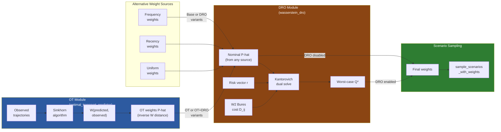

</details>

**Experimental variants** (controlled in `mpc_controller.cpp` lines 92-130):

| Variant | `use_ot_sampling` | `enable_dro` | Weight pipeline |
|---|---|---|---|
| **Base** | off | off | Frequency/recency $\hat{P}$ -> sample |
| **OT** | on | off | OT-learned $\hat{P}$ -> sample |
| **DRO** | off | on | Frequency $\hat{P}$ -> Kantorovich dual -> $Q^*$ -> sample |
| **OT+DRO** | on | on | OT-learned $\hat{P}$ -> Kantorovich dual -> $Q^*$ -> sample |

Each variant can be further combined with Safe Horizon (+SH) and Adversarial injection (+ADV).

---

### 3.8 Collision Constraints

**Files**: [`include/collision_constraints.hpp`](../include/collision_constraints.hpp), [`src/collision_constraints.cpp`](../src/collision_constraints.cpp)

Linearized collision avoidance constraints (Section 7, Eqs. 16-18).

**Multi-disc model** (Eq. 16): Place $D$ discs along the vehicle centerline:

$$p_d = p_\text{ego} + \text{offset}_d \cdot \begin{bmatrix}\cos\theta \\ \sin\theta\end{bmatrix}, \quad d = 1, \ldots, D$$

**Separating hyperplane** (Eqs. 17-18):

$$\mathbf{a} = \frac{p_d - p_\text{obs}}{\|p_d - p_\text{obs}\|}, \quad \mathbf{a}^\top p_\text{ego} \geq \mathbf{a}^\top p_\text{obs} + r_\text{ego} + r_\text{obs} + \text{margin}$$

<details>
<summary><b>Click to expand: Constraint Generation Flow</b></summary>

```mermaid
flowchart TD
    subgraph Inputs
        REF[Reference trajectory<br/>vector EgoState]
        SCEN[Scenarios<br/>vector Scenario]
        PARAMS["r_ego, r_obs, margin, D"]
    end

    REF --> FOREACH_K[For each timestep k = 1..N]
    SCEN --> FOREACH_S[For each scenario s]

    FOREACH_K --> FOREACH_S
    FOREACH_S --> FOREACH_O[For each obstacle o in scenario]
    FOREACH_O --> DISC_POS[Compute D disc positions<br/>along ego centerline at k]

    DISC_POS --> FOREACH_D[For each disc d = 1..D]
    FOREACH_D --> DIRECTION["a = (p_d - p_obs) / ||p_d - p_obs||"]
    DIRECTION --> DEGENERATE{||p_d - p_obs|| < 1e-6?}
    DEGENERATE -->|Yes| DEFAULT_A["a = [1, 0]"]
    DEGENERATE -->|No| HALFPLANE["b = a^T * p_obs + r_ego + r_obs + margin"]
    DEFAULT_A --> HALFPLANE

    HALFPLANE --> CONSTRAINT[CollisionConstraint<br/>k, obstacle_id, scenario_id, a, b]
    CONSTRAINT --> COLLECT[Collect all constraints<br/>Total: N * S * O * D]

    subgraph Evaluation
        EVAL[evaluate_constraint_violation<br/>Returns max violation + list]
    end

    COLLECT --> EVAL

    style Inputs fill:#1a3a1a,color:#fff
```

</details>

**Constraint count**: For $N$ timesteps, $S$ scenarios, $O$ obstacles, $D$ discs: $|\text{constraints}| = N \times S \times O \times D$. With defaults ($N=20, S=10, O=1, D=3$): up to 600 constraints per solve.

| Function | Description |
|---|---|
| `compute_linearized_constraints(ref_traj, scenarios, ...)` | Build all halfplane constraints |
| `compute_ego_disc_positions(state, D, L)` | D discs along vehicle centerline |
| `evaluate_constraint_violation(constraints, trajectory)` | Returns `(max_violation, violated_list)` |

---

### 3.9 Scenario Pruning

**Files**: [`include/scenario_pruning.hpp`](../include/scenario_pruning.hpp), [`src/scenario_pruning.cpp`](../src/scenario_pruning.cpp)

Two algorithms for reducing scenario count while preserving guarantees.

**Algorithm 3 -- Dominance Pruning** (`prune_dominated_scenarios`):
Scenario $s_1$ dominates $s_2$ if for all $(k, o)$, $s_1$'s obstacle is closer to ego (more constraining). Prune $s_2$ since its constraints are automatically satisfied when $s_1$'s are satisfied.

**Algorithm 4 -- Inactive Removal** (`remove_inactive_scenarios`):
After solving, remove scenarios whose constraints had zero slack (non-binding). Only scenarios with at least one binding constraint are kept for the next iteration.

<details>
<summary><b>Click to expand: Pruning Pipeline</b></summary>

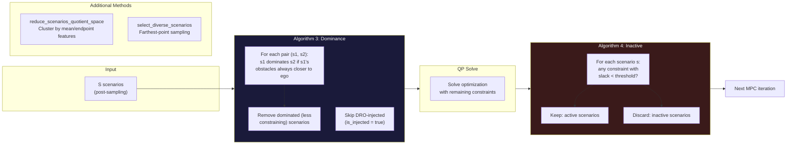

</details>

| Function | Algorithm | Description |
|---|---|---|
| `prune_dominated_scenarios(...)` | Alg. 3 | Remove s2 if s1 dominates at all (k, o) |
| `remove_inactive_scenarios(...)` | Alg. 4 | Remove scenarios with no binding constraints |
| `reduce_scenarios_quotient_space(...)` | -- | Cluster in low-dim feature space, keep representatives |
| `select_diverse_scenarios(...)` | -- | Farthest-point sampling for diversity |

---

### 3.10 Reference Path & MPCC

**Files**: [`include/reference_path.hpp`](../include/reference_path.hpp), [`src/reference_path.cpp`](../src/reference_path.cpp)

The MPCC (Model Predictive Contouring Control) cost follows the path rather than tracking a point goal.

**Path types**:

| Factory | Formula |
|---|---|
| `create_straight(start, end)` | Linear interpolation |
| `create_s_curve(L, A, n)` | $y = A \sin(2\pi x / L)$ |
| `create_circle(center, r, \theta_0, \theta_1)` | Circular arc |

| Method | Description |
|---|---|
| `get_point_at(s)` | Returns `PathPoint{position, heading, curvature, s}` |
| `find_closest_point(position)` | Closest arc-length projection |
| `find_closest_point(position, min_s)` | Monotonic (forward-only) projection |
| `compute_lateral_offset(position, s)` | Signed lateral distance from path |
| `total_length()` | Total arc length |

**MPCC Cost** (Paper Eq. 6):

$$J_\text{MPCC} = \sum_{k=1}^{N_\text{mpcc}} \left[w_c \, e_c(k)^2 + w_l \, e_l(k)^2\right] + w_\theta \left(\theta_{N_\text{mpcc}} - \theta_\text{path}\right)^2$$

where:
- **Contouring error**: $e_c(k) = \mathbf{n}(s)^\top\!\big(p(k) - p_\text{path}(s)\big)$, with $\mathbf{n} = [-\sin\theta_\text{path}, \cos\theta_\text{path}]^\top$
- **Lag error**: $e_l(k) = -\mathbf{t}(s)^\top\!\big(p(k) - p_\text{path}(s)\big)$, with $\mathbf{t} = [\cos\theta_\text{path}, \sin\theta_\text{path}]^\top$
- **Cost horizon limiting**: $N_\text{mpcc} = \min(\text{cost\_horizon}, N)$ when safe horizon is active

<details>
<summary><b>Click to expand: MPCC Cost Construction in QP</b></summary>

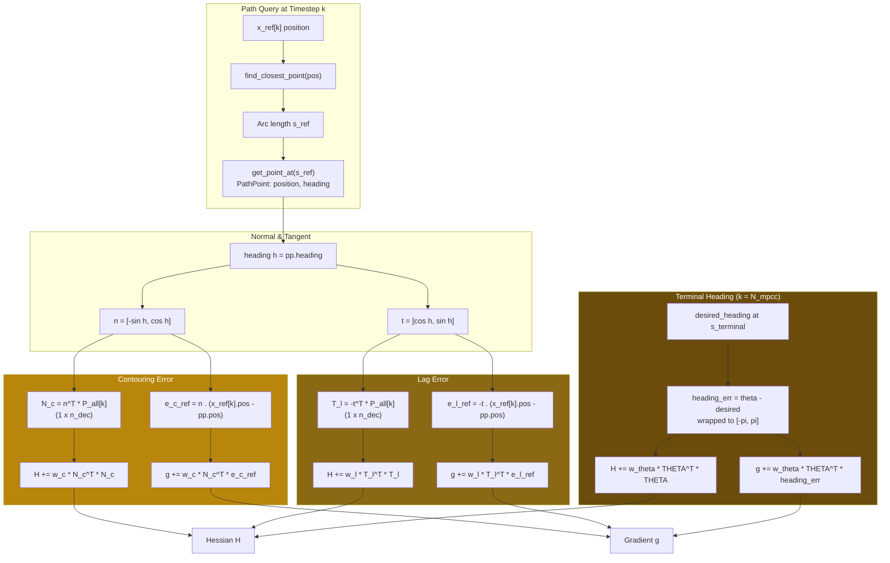

</details>

**Velocity tracking reduction**: Beyond $N_\text{mpcc}$, velocity weight is reduced to 10% ($w_\text{vel} \times 0.1$) to prevent the optimizer from aggressively driving into unconstrained steps.

---

### 3.11 QP Solver (ADMM)

**Files**: [`include/qp_solver.hpp`](../include/qp_solver.hpp), [`src/qp_solver.cpp`](../src/qp_solver.cpp)

Pure Eigen ADMM solver (no external dependencies).

**Problem form**:

$$\min_{x} \;\frac{1}{2}x^\top H x + g^\top x \quad \text{s.t.} \quad Cx \geq d, \quad l \leq x \leq u$$

**ADMM iterations**:

$$x^{k+1} = (H + \rho A^\top A)^{-1}(-g + \rho A^\top(z^k - \lambda^k))$$

$$z^{k+1} = \text{proj}_{\mathcal{K}}(Ax^{k+1} + \lambda^k)$$

$$\lambda^{k+1} = \lambda^k + Ax^{k+1} - z^{k+1}$$

<details>
<summary><b>Click to expand: ADMM Solver Internals</b></summary>

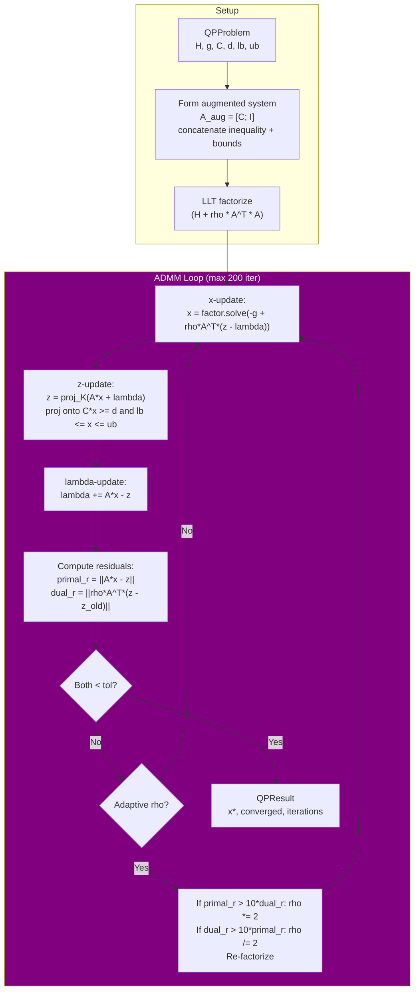

</details>

**Key settings**:

| Parameter | Default | Description |
|---|---|---|
| `max_iterations` | 200 | Maximum ADMM iterations |
| `abs_tol` | $10^{-4}$ | Absolute convergence tolerance |
| `rho` | 1.0 | ADMM penalty parameter |
| `adaptive_rho` | true | Auto-tune $\rho$ based on residual balance |

| Class/Struct | Description |
|---|---|
| `QPProblem` | H, g, C, d, lb, ub |
| `QPResult` | x*, converged, iterations, residuals |
| `QPSettings` | rho, max_iter, tolerances, adaptive_rho |
| `ADMMSolver` | `solve(prob, settings)`, `warm_start(x0)` |

---

### 3.12 MPC Controller

**Files**: [`include/mpc_controller.hpp`](../include/mpc_controller.hpp), [`src/mpc_controller.cpp`](../src/mpc_controller.cpp)

The integration hub -- `AdaptiveScenarioMPC` orchestrates all modules.

<details>
<summary><b>Click to expand: Controller Internal State</b></summary>

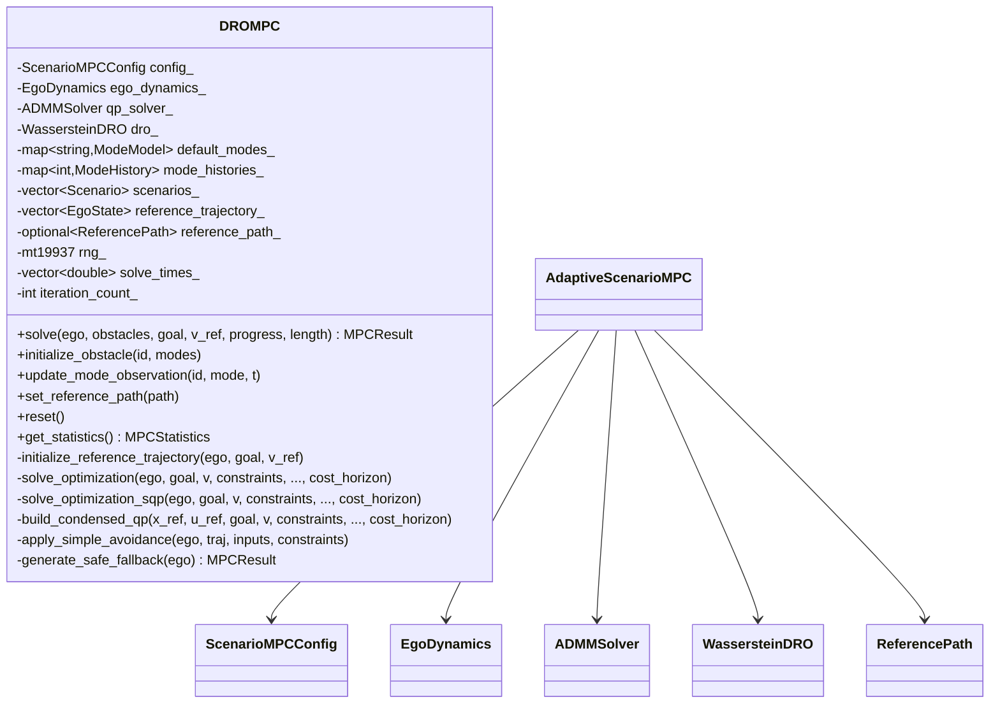

</details>

**Public API**:

| Method | Description |
|---|---|
| `solve(ego, obstacles, goal, v_ref, progress, length)` | Full MPC solve (see [Section 5](#5-control-flow-single-mpc-solve)) |
| `initialize_obstacle(id, modes)` | Register an obstacle with available modes |
| `update_mode_observation(id, mode, t)` | Record observed mode at timestep t |
| `set_reference_path(path)` | Set MPCC reference path (Paper Eq. 6) |

**Private optimization pipeline**:

| Method | Description |
|---|---|
| `solve_optimization(..., cost_horizon)` | Dispatches to SQP or heuristic; `cost_horizon` limits MPCC costs |
| `solve_optimization_sqp(..., cost_horizon)` | SQP outer loop with line search |
| `build_condensed_qp(..., cost_horizon)` | **Core**: condensed dynamics + MPCC cost + constraints -> `QPProblem` |
| `initialize_reference_trajectory(...)` | Warmstart from previous solution |
| `apply_simple_avoidance(...)` | Heuristic constraint repair |
| `generate_safe_fallback(...)` | Emergency braking trajectory |

**Condensed QP construction** (`build_condensed_qp`, line 697):

For linearized dynamics $\delta x_{k+1} = A_k \delta x_k + B_k \delta u_k$, the condensed form eliminates states:

$$\delta x_k = \sum_{j=0}^{k-1} M_{kj} \cdot \delta u_j, \quad M_{kj} = \Phi(k, j+1) B_j$$

where $\Phi(k,j) = A_{k-1} A_{k-2} \cdots A_j$ is the state transition matrix.

Sensitivity matrices extract specific states:
- **Position**: $P_k = E \cdot M_k$ where $E = \begin{bmatrix}1&0&0&0\\0&1&0&0\end{bmatrix}$
- **Velocity**: $V_k = V_\text{row} \cdot M_k$ where $V_\text{row} = [0,0,0,1]$
- **Heading**: $\Theta_k = \Theta_\text{row} \cdot M_k$ where $\Theta_\text{row} = [0,0,1,0]$

<details>
<summary><b>Click to expand: Condensed QP Structure</b></summary>

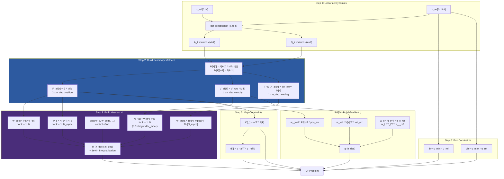

</details>

**SQP loop** (max 5 iterations):
1. Build condensed QP at current reference $(x_\text{ref}, u_\text{ref})$
2. Solve QP via ADMM to get $\delta u^*$
3. Line search: try $\alpha \in \{1, 0.5, 0.25\}$, pick step with lowest constraint violation
4. Update reference: $u_\text{ref} \leftarrow u_\text{ref} + \alpha \cdot \delta u^*$
5. Re-propagate: $x_\text{ref} \leftarrow \text{rollout}(\text{ego}, u_\text{ref})$
6. Check convergence: $\|\delta u\| < \text{tol}$

**Fallback hierarchy**:
1. SQP solution (if feasible)
2. Approximately feasible SQP (violation < 0.1)
3. Safe fallback: emergency braking trajectory ($a = -1.0$, $\omega = 0$)

**Controller state persistence** between solves:
- `mode_histories_`: Observation history per obstacle (grows with `record_observation`)
- `scenarios_`: Post-pruning scenarios from last solve (warmstart for constraint generation)
- `reference_trajectory_`: Previous ego trajectory (shifted forward as warmstart)
- `solve_times_`: Solve timing history (for statistics)
- `iteration_count_`: Global timestep counter

---

### 3.13 Experiment Infrastructure

**Files**: [`include/experiment_harness.hpp`](../include/experiment_harness.hpp), [`src/experiment_harness.cpp`](../src/experiment_harness.cpp), [`tests/paper_experiment_runner.cpp`](../tests/paper_experiment_runner.cpp), [`tests/test_obstacle_class.cpp`](../tests/test_obstacle_class.cpp)

<details>
<summary><b>Click to expand: Experiment Execution Architecture</b></summary>

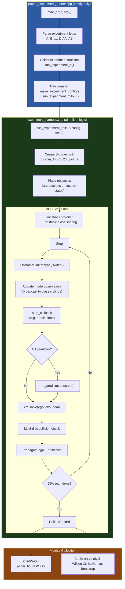

</details>

**Separation of concerns:**

The experiment harness (`experiment_harness.cpp`) owns ALL rollout logic. The paper runner (`paper_experiment_runner.cpp`) is a pure configuration layer that maps experiment parameters to `ExperimentConfig` and converts results back via `RolloutResult::from_record()`.

| Layer | File | Responsibility |
|---|---|---|
| Harness | `experiment_harness.cpp` | Obstacle simulation, mode observation (with class sharing), multi-disc collision detection, S-curve path, OT predictor, path completion, distribution shift, per-step callbacks |
| Runner | `paper_experiment_runner.cpp` | Experiment configs (A-AB), `PaperVariant` mapping, CSV aggregation. Three thin wrappers: `run_single_rollout()`, `run_single_rollout_env()`, `run_multi_obstacle_rollout()` |

**Paper runner wrappers (all delegate to `run_experiment_rollout()`)**:

| Function | Description |
|---|---|
| `make_experiment_config()` | Maps `PaperVariant` + params to `ExperimentConfig` (weight_type, enable_dro, safe_horizon, OT predictor) |
| `run_single_rollout()` | Standard rollout (calls `make_experiment_config` + `run_experiment_rollout`) |
| `run_single_rollout_env()` | Custom environment: maps `EnvironmentSetup` to `initial_obstacle_states`, `SamplingBaseline` to `WeightType` via `baseline_to_weight()`, oracle flood via `step_callback` |
| `run_multi_obstacle_rollout()` | Multi-obstacle: sets `num_obstacles`, `obstacles_per_class`, `obs_arc_fractions` |
| `RolloutResult::from_record()` | Converts `RolloutRecord` to local `RolloutResult` (unit conversion: ms->s) |

**Harness utilities (in `experiment_harness.hpp/cpp`)**:

| Function | Description |
|---|---|
| `run_experiment_rollout()` | THE canonical rollout function — all experiments call this |
| `obstacle_on_s_curve()` | Places obstacle at given arc-length fraction with lateral jitter |
| `apply_distribution_shift()` | Applies distribution shift to an obstacle simulator |
| `configure_ablation()` | Maps `AblationVariant` to `ScenarioMPCConfig` + `DROConfig` |
| `percentile()` | Compute percentile of a vector |

**Obstacle class sharing**:

Obstacles assigned to the same class share mode observation history. This is used for multi-obstacle scenarios where obstacles of the same type (e.g. all pedestrians) should pool their behavioral observations.

- `ModeHistory::obstacle_class` — stored per obstacle, used for grouping
- `AdaptiveScenarioMPC::update_mode_observation(obs_id, obs_class, mode, step)` — broadcasts observation to all obstacles with matching class
- `AdaptiveScenarioMPC::initialize_obstacle(id, class, models)` — copies existing sibling history for late-joining obstacles
- `ExperimentConfig::obstacles_per_class` — controls how many obstacles share a class in rollouts

**Controller variant composition** (4 base + extensions):

| Variant | `enable_dro` | `use_ot_predictor` | `safe_horizon_enabled` | `injection_mode` |
|---|---|---|---|---|
| Base | false | false | true | N/A |
| DRO | true | false | true | DRO |
| OT | false | true | true | N/A |
| OT+DRO (OT+SH) | true | true | true | DRO |
| +ADV | true | varies | true | ADVERSARIAL |

**Statistical methods**:

| Test | Function | Purpose |
|---|---|---|
| Wilson CI | `wilson_ci(k, n)` | Confidence interval for proportion |
| McNemar $\chi^2$ | `mcnemar_chi2(b, c)` | Paired test for collision rate difference |
| Bootstrap CI | `bootstrap_paired_delta(base, dro, n)` | Paired delta with 10,000 resamples |
| Cohen's $h$ | `compute_effect_sizes(p1, p2)` | Effect size for proportion differences |
| Permutation test | In `test_statistical_power.cpp` | Non-parametric significance |

**Experiment harness types**:

| Type | Description |
|---|---|
| `ExperimentConfig` | All experiment parameters: MPC config, obstacle placement, OT predictor, step callbacks, path completion |
| `RolloutRecord` | Per-rollout metrics: collision, clearance, progress, timing, DRO stats, rare mode tracking |
| `ObstacleSim` | Ground-truth obstacle simulator with mode switching and process noise |
| `CSVWriter` | Writes `RolloutRecord` to CSV |

---

## 4. File Reference

### 4.1 Headers

| File | Purpose |
|---|---|
| [`include/types.hpp`](../include/types.hpp) | Core data structures (EgoState, Scenario, etc.) |
| [`include/config.hpp`](../include/config.hpp) | All hyperparameters + scenario/SH computation methods |
| [`include/dynamics.hpp`](../include/dynamics.hpp) | Ego unicycle dynamics + obstacle mode factory |
| [`include/mode_weights.hpp`](../include/mode_weights.hpp) | Mode weight computation (6 strategies) |
| [`include/scenario_sampler.hpp`](../include/scenario_sampler.hpp) | Algorithm 1: scenario generation (5 variants) |
| [`include/collision_constraints.hpp`](../include/collision_constraints.hpp) | Multi-disc linearized collision avoidance |
| [`include/scenario_pruning.hpp`](../include/scenario_pruning.hpp) | Algorithms 3 & 4: dominance pruning, inactive removal |
| [`include/qp_solver.hpp`](../include/qp_solver.hpp) | ADMM QP solver (Eigen-only) |
| [`include/wasserstein_dro.hpp`](../include/wasserstein_dro.hpp) | Kantorovich dual DRO + W2 Bures metric |
| [`include/reference_path.hpp`](../include/reference_path.hpp) | Reference path for MPCC contouring cost |
| [`include/mpc_controller.hpp`](../include/mpc_controller.hpp) | Algorithm 2: AdaptiveScenarioMPC controller |
| [`include/optimal_transport_predictor.hpp`](../include/optimal_transport_predictor.hpp) | OT-based dynamics learning (Sinkhorn, barycenter) |
| [`include/trajectory_moments.hpp`](../include/trajectory_moments.hpp) | Proposition 1: recursive mean/covariance |
| [`include/experiment_harness.hpp`](../include/experiment_harness.hpp) | Canonical rollout API: `ExperimentConfig`, `RolloutRecord`, `ObstacleSim`, statistical helpers, `run_experiment_rollout()` |

### 4.2 Sources

| File | Key Implementation Details |
|---|---|
| [`src/dynamics.cpp`](../src/dynamics.cpp) | RK4 integration, Jacobians (finite differences), `create_obstacle_mode_models()` factory |
| [`src/mode_weights.cpp`](../src/mode_weights.cpp) | Six weight strategies, observation gate, cold-start handling |
| [`src/scenario_sampler.cpp`](../src/scenario_sampler.cpp) | Algorithm 1, `make_stationary_trajectory()` for cold-start obstacles |
| [`src/collision_constraints.cpp`](../src/collision_constraints.cpp) | Multi-disc (D=3) linearized constraints (Eqs. 16-18) |
| [`src/scenario_pruning.cpp`](../src/scenario_pruning.cpp) | Geometric dominance, inactive removal, quotient-space reduction |
| [`src/qp_solver.cpp`](../src/qp_solver.cpp) | ADMM: augmented system, LLT factorize, adaptive rho |
| [`src/wasserstein_dro.cpp`](../src/wasserstein_dro.cpp) | Binary search on Kantorovich dual, W2 Bures transport cost, risk vector |
| [`src/reference_path.cpp`](../src/reference_path.cpp) | Path discretization, `find_closest_point` with monotonic variant |
| [`src/mpc_controller.cpp`](../src/mpc_controller.cpp) | **Core**: Algorithm 2 pipeline, `build_condensed_qp()`, SQP+ADMM, DRO integration |
| [`src/optimal_transport_predictor.cpp`](../src/optimal_transport_predictor.cpp) | Sinkhorn algorithm, Wasserstein barycenter, OT mode weights |
| [`src/trajectory_moments.cpp`](../src/trajectory_moments.cpp) | Proposition 1 recursive computation |
| [`src/experiment_harness.cpp`](../src/experiment_harness.cpp) | ALL rollout logic: `run_experiment_rollout()`, `ObstacleSim`, obstacle placement, multi-disc collision, OT predictor, obstacle class sharing, path completion, per-step callbacks |

### 4.3 Tests

| File | Binary | Description |
|---|---|---|
| [`tests/paper_experiment_runner.cpp`](../tests/paper_experiment_runner.cpp) | `paper_experiment_runner` | 28 experiments (A-Z, AA, AB). Config layer only — all rollouts delegate to `run_experiment_rollout()` via thin wrappers. |
| [`tests/test_dro_framework.cpp`](../tests/test_dro_framework.cpp) | `test_dro_framework` | 6 hypotheses (H1-H6) about DRO module |
| [`tests/test_statistical_power.cpp`](../tests/test_statistical_power.cpp) | `test_statistical_power` | High-power tests (2000 rollouts), McNemar, bootstrap, permutation |
| [`tests/test_obstacle_class.cpp`](../tests/test_obstacle_class.cpp) | `test_obstacle_class` | Validates obstacle class sharing: observation broadcast, late-join inheritance, class independence, multi-obstacle rollout, ExperimentConfig integration |

---

## 5. Control Flow: Single MPC Solve

### Entry: `AdaptiveScenarioMPC::solve()` ([`src/mpc_controller.cpp:61`](../src/mpc_controller.cpp))

```
1. Initialize reference trajectory (warmstart or straight-line)
   +-- initialize_reference_trajectory()  [line 314]

2. Sample scenarios
   |-- Per obstacle: compute_mode_weights() with observation gate
   |   |-- If no modes observed -> empty weights -> stationary trajectory
   |   +-- If >=1 mode observed -> weights over witnessed modes only
   |-- If DRO enabled: compute q* via WassersteinDRO -> sample from q*
   |   +-- Obstacles with empty nominal weights are skipped (stationary fallback)
   |-- If custom weights: sample from external weights
   |-- If mode coverage: sample_scenarios_with_mode_coverage()
   +-- Else: sample_scenarios()

3. Prune dominated scenarios
   +-- prune_dominated_scenarios()  [Algorithm 3]

4. Verify scenario sufficiency (Theorem 1)
   +-- If S < S_required and enforce: sample additional

5. Compute linearized collision constraints
   +-- compute_linearized_constraints()  [Eqs. 17-18]

6. Safe horizon truncation
   +-- config_.compute_safe_horizon(S) -> filter constraints beyond N_safe

7. Solve optimization (cost_horizon = N_safe when SH active, else -1)
   +-- solve_optimization(cost_horizon) -> dispatches to:
      |-- solve_optimization_sqp(cost_horizon)
      |   |-- SQP loop (max 5 iterations):
      |   |   |-- build_condensed_qp(cost_horizon)  <-- MPCC costs limited to N_mpcc
      |   |   |-- ADMMSolver::solve(qp)
      |   |   +-- Line search (full/half/quarter step)
      |   +-- Compute final cost (goal + velocity + control + MPCC over N_mpcc)
      +-- Heuristic fallback (straight-line + simple avoidance)

8. Remove inactive scenarios
   +-- remove_inactive_scenarios()  [Algorithm 4]

9. Record timing, return MPCResult
```

### Core: `build_condensed_qp()` ([`src/mpc_controller.cpp:658`](../src/mpc_controller.cpp))

**Condensed formulation**: eliminate state variables, express everything in terms of `delta_u in R^{2N}`.

```
Step 1: Linearize dynamics at each k -> (A_k, B_k)
Step 2: Build sensitivity matrices M[k][j] = Phi(k,j+1)*B[j]
        P_all[k] = E*M[k]          (2 x n_dec, position)
        V_all[k] = V_row*M[k]      (1 x n_dec, velocity)
        THETA_all[k] = THETA_row*M[k]  (1 x n_dec, heading)

Step 3: Compute N_mpcc = min(cost_horizon, N) for MPCC cost limiting

Step 4: Hessian H
        H += w_goal * P[k]^T*P[k]           (goal tracking, k=1..N)
        H += w_vel  * V[k]^T*V[k]           (velocity tracking, k=1..N)
        H += diag(w_accel, w_steer, ...)     (control effort)
        H += w_c * N_c[k]^T*N_c[k]          (contouring -- MPCC, k=1..N_mpcc)
        H += w_l * T_l[k]^T*T_l[k]          (lag -- MPCC, k=1..N_mpcc)
        H += w_theta * THETA[N_mpcc]^T*THETA[N_mpcc]  (terminal heading)
        H += 1e-6*I                          (regularization)

Step 5: Gradient g
        g += w_goal * P[k]^T*(p_ref[k] - goal)
        g += w_vel  * V[k]^T*(v_ref[k] - v_target)
        g += w_c * N_c[k]^T*e_c_ref         (k=1..N_mpcc)
        g += w_l * T_l[k]^T*e_l_ref         (k=1..N_mpcc)
        g += w_theta * THETA[N_mpcc]^T*heading_err

Step 6: Constraints C*delta_u >= d
        C[i,:] = a^T*P[k]
        d[i]   = b - a^T*p_ref[k]

Step 7: Box constraints on delta_u
        lb = u_min - u_ref,  ub = u_max - u_ref
```

### Call Graph (Who Calls Whom)

```
mpc_controller.solve()
|-- mode_weights::compute_mode_weights()          [per obstacle]
|-- wasserstein_dro::compute_worst_case_weights()  [if DRO enabled]
|-- scenario_sampler::sample_scenarios*()          [one of 5 variants]
|-- scenario_pruning::prune_dominated_scenarios()  [Algorithm 3]
|-- collision_constraints::compute_linearized_constraints()
|-- config::compute_safe_horizon()                 [if SH enabled]
|-- mpc_controller::solve_optimization_sqp()
|   |-- mpc_controller::build_condensed_qp()
|   |   |-- dynamics::get_jacobians()              [per timestep]
|   |   |-- reference_path::find_closest_point()   [MPCC cost, per k]
|   |   +-- reference_path::get_point_at()         [MPCC vectors]
|   |-- qp_solver::ADMMSolver::solve()
|   |-- dynamics::rollout()                        [line search]
|   +-- collision_constraints::evaluate_constraint_violation()
+-- scenario_pruning::remove_inactive_scenarios()  [Algorithm 4]
```

### Data Flow Summary

| Stage | Input | Output | Module |
|---|---|---|---|
| 1. Weight | `ModeHistory` | `map<string, double>` weights | `mode_weights` |
| 2. DRO | Nominal weights + ego ref traj | `DROResult` with Q* | `wasserstein_dro` |
| 3. Sample | Weights + obstacles + modes | `vector<Scenario>` | `scenario_sampler` |
| 4. Prune | Scenarios + ego ref traj | Reduced `vector<Scenario>` | `scenario_pruning` |
| 5. Constrain | Scenarios + ego ref traj | `vector<CollisionConstraint>` | `collision_constraints` |
| 6. Truncate | Constraints + N_safe | Filtered constraints | `config` |
| 7. Optimize | Constraints + goal + ref path | `QPProblem` -> `QPResult` | `mpc_controller` + `qp_solver` |
| 8. Clean | Scenarios + solution | Active scenarios | `scenario_pruning` |

---

## 6. Mathematical Formulations & Verification

This section consolidates all mathematical formulations and verifies their implementation.

<details>
<summary><b>Click to expand: Complete Mathematical Reference</b></summary>

### 6.1 Ego Dynamics (Section 2)

**Continuous**: $\dot{x} = f(x, u) = [v\cos\theta,\; v\sin\theta,\; \omega,\; a]^\top$

**Discrete (RK4)**: $x_{k+1} = f_d(x_k, u_k)$ with $O(\Delta t^4)$ accuracy

**Linearization**: $\delta x_{k+1} = A_k \delta x_k + B_k \delta u_k$ via finite differences

**Verification**: Standard unicycle, RK4 is appropriate for smooth dynamics.

### 6.2 Obstacle Mode Dynamics (Section 3)

$$x_{k+1}^{\text{obs}} = A_m x_k^{\text{obs}} + b_m + G_m w_k, \quad w_k \sim \mathcal{N}(0, I)$$

### 6.3 Mode Weights (Section 4)

**Frequency**: $w_m = \frac{\text{count}_m}{\sum_{m'} \text{count}_{m'}}$

**Recency**: $w_m \propto \sum_{t=1}^{T} \lambda^{T-t} \cdot \mathbb{1}[\text{mode}_t = m]$, $\lambda = 0.9$

### 6.4 Scenario Sampling (Theorem 1)

$$S \geq \frac{2}{\varepsilon}\left(\ln\frac{1}{\beta} + d + R\right)$$

**Tight bound** (Eq. 25): $S \geq \frac{2}{\varepsilon}\ln\frac{1}{\beta} + 2\bar{n} + \frac{2\bar{n}}{\varepsilon}\ln\frac{2}{\varepsilon}$

**Code** (`compute_required_scenarios` at config.hpp:141):
```cpp
return ceil(2.0/epsilon() * (log(1.0/beta) + num_constraints + num_removal));
```
Direct implementation of Theorem 1. The tight bound (Eq. 25) at line 158 also matches.

### 6.5 Safe Horizon (Theorem 1, Practical)

$$N_{\text{safe}} = \min\!\left(N,\; \left\lfloor\frac{S}{2n_u}\right\rfloor\right)$$

Clamped to $[N_{\text{safe,min}},\; N]$ where $N_{\text{safe,min}} = 12$.

**Code** (config.hpp:200): `N_safe = std::min(horizon, S_actual / (2 * n_u))` -- integer division gives floor.

### 6.6 Collision Constraints (Section 7)

**Multi-disc** (Eq. 16): $p_d = p_\text{ego} + \text{offset}_d \cdot [\cos\theta, \sin\theta]^\top$

**Direction** (Eq. 17): $\mathbf{a} = (p_d - p_\text{obs}) / \|p_d - p_\text{obs}\|$

**Halfplane** (Eq. 18): $\mathbf{a}^\top p_\text{ego} \geq \mathbf{a}^\top p_\text{obs} + r_\text{ego} + r_\text{obs} + m$

Standard linearized circle-circle collision avoidance.

### 6.7 MPCC Cost (Eq. 6)

$$J_\text{MPCC} = \sum_{k=1}^{N_\text{mpcc}} \left[w_c \, e_c(k)^2 + w_l \, e_l(k)^2\right] + w_\theta (\theta_{N_\text{mpcc}} - \theta_\text{path})^2$$

$e_c = \mathbf{n}^\top(p - p_\text{path})$, $e_l = -\mathbf{t}^\top(p - p_\text{path})$

**Code** (mpc_controller.cpp:~780):
```cpp
Eigen::Vector2d t_ref(cos(ph), sin(ph));
Eigen::Vector2d n_ref(-sin(ph), cos(ph));
Eigen::RowVectorXd N_c = n_ref.transpose() * P_all[k];
double e_c_ref = n_ref.dot(x_ref[k].position() - pp.position);
Eigen::RowVectorXd T_l = -t_ref.transpose() * P_all[k];
double e_l_ref = -t_ref.dot(x_ref[k].position() - pp.position);
H += w_c * N_c.transpose() * N_c;
H += w_l * T_l.transpose() * T_l;
g += w_c * N_c.transpose() * e_c_ref;
g += w_l * T_l.transpose() * e_l_ref;
```

QP linearization `e_c ~ n^T*P[k]*delta_u + e_c_ref` is correct first-order approximation. Hessian `N_c^T*N_c` and gradient `N_c^T*e_c_ref` are the standard quadratic form.

**MPCC Cost Horizon**: When safe horizon is active, MPCC costs limited to `N_mpcc = min(cost_horizon, N)`. Velocity tracking weight reduced to 10% beyond N_mpcc. Combined with `safe_horizon_min = 12`, this ensures OT+SH achieves lowest collision rates.

### 6.8 Condensed QP

$$\min_{\delta u} \frac{1}{2}\delta u^\top H \delta u + g^\top \delta u \quad \text{s.t.} \quad C\delta u \geq d, \quad l \leq \delta u \leq u$$

**Sensitivity**: $\delta x_k = \sum_j M_{kj} \delta u_j$, $P_k = E M_k$, $V_k = V_\text{row} M_k$

**Hessian**:
$$H = \sum_{k=1}^{N} w_\text{goal} P_k^\top P_k + \sum_{k=1}^{N} w_\text{vel} V_k^\top V_k + \text{diag}(w_a, w_\delta, \ldots) + \sum_{k=1}^{N_\text{mpcc}} \left(w_c N_c^\top N_c + w_l T_l^\top T_l\right) + w_\theta \Theta_{N_\text{mpcc}}^\top \Theta_{N_\text{mpcc}} + 10^{-6}I$$

**Code** (mpc_controller.cpp:715-735):
```cpp
M_new[j] = A_k[k-1] * M_current[j];  // propagate existing
M_new[k-1] = B_k[k-1];                // new input contribution
P_all[k].block<2,2>(0, 2*j) = E * M_new[j];  // extract position
```
Correct incremental construction of condensed sensitivity matrices.

### 6.9 ADMM

$$x^{k+1} = (H + \rho A^\top A)^{-1}(-g + \rho A^\top(z^k - \lambda^k))$$

$$z^{k+1} = \text{proj}_{\mathcal{K}}(Ax^{k+1} + \lambda^k), \quad \lambda^{k+1} = \lambda^k + Ax^{k+1} - z^{k+1}$$

Standard ADMM. Convergence guaranteed for convex QP with PSD H (ensured by 1e-6 regularization).

### 6.10 Wasserstein DRO (Kantorovich Dual)

$$\sup_{Q \in \mathcal{B}_\varepsilon(\hat{P})} \mathbb{E}_Q[r] = \inf_{\lambda \geq 0}\left\{\lambda\varepsilon + \sum_i w_i \max_j\!\left(r_j - \lambda D_{ij}\right)\right\}$$

**Transport cost** (W2 Bures):
$$D_{ij} = \frac{1}{N}\sum_{k=1}^{N} W_2^2\!\left(\mathcal{N}(\mu_i^k, \Sigma_i^k),\, \mathcal{N}(\mu_j^k, \Sigma_j^k)\right)$$

**Risk vector**: $r_m = \max_k \max\!\left(0,\; r_\text{safe} + \sigma_\text{scale}\sqrt{\text{tr}(\Sigma_k^m)} - \min_d\|p_d^k - \mu_m^k\|\right)$

Standard Kantorovich duality for W1 DRO. Binary search is sound since the dual objective is convex in lambda.

### 6.11 Sinkhorn Algorithm

$$\min_P \langle C, P\rangle + \varepsilon H(P) \quad \text{s.t.} \quad P\mathbf{1} = a, \; P^\top\mathbf{1} = b$$

**Gibbs kernel**: $K = \exp(-C/\varepsilon)$

**Iterations**: $u \leftarrow a \oslash (Kv)$, $v \leftarrow b \oslash (K^\top u)$

**Transport plan**: $P^* = \text{diag}(u) \cdot K \cdot \text{diag}(v)$

Standard Sinkhorn-Knopp (Cuturi 2013). Convergence is geometric for eps > 0.

### 6.12 Trajectory Moments (Proposition 1)

$$\mu_k = \sum_m w_m (A_m \mu_{k-1} + b_m)$$

$$\Sigma_k = \sum_m w_m (A_m \Sigma_{k-1} A_m^\top + G_m G_m^\top) + \sum_m w_m (\mu_m^k - \mu_k)(\mu_m^k - \mu_k)^\top$$

Law of total expectation and total variance applied to the mixture model.

### 6.13 Statistical Tests

**Wilson CI**: $\hat{p} \pm z_\alpha \sqrt{\hat{p}(1-\hat{p})/n + z_\alpha^2/(4n^2)}$

**McNemar**: $\chi^2 = (|b-c| - 1)^2 / (b+c)$ with continuity correction

**Cohen's** $h$: $h = 2\arcsin\sqrt{p_1} - 2\arcsin\sqrt{p_2}$

</details>

---

## 7. Integration Matrix

This matrix shows which modules directly call which. Each cell indicates the nature of the dependency.

<details>
<summary><b>Click to expand: Full Module Integration Matrix</b></summary>

| Caller / Callee -> | types | config | dynamics | mode_weights | scenario_sampler | collision_constraints | scenario_pruning | qp_solver | wasserstein_dro | reference_path | optimal_transport | trajectory_moments | experiment_harness |
|---|---|---|---|---|---|---|---|---|---|---|---|---|---|
| **mpc_controller** | data types | params | rollout, jacobians | compute_mode_weights | sample_scenarios* | compute_linearized_constraints | prune_dominated, remove_inactive | ADMM solve | compute_worst_case_weights | find_closest_point, get_point_at | - | - | - |
| **experiment_harness** | data types | params | - | - | - | - | - | - | - | create_s_curve | create_ot_predictor | - | - |
| **paper_experiment_runner** | data types | params | create_obstacle_modes | - | - | evaluate_constraint_violation | - | - | - | create_s_curve | create_ot_predictor | - | run_experiment_rollout |
| **test_dro_framework** | data types | params | create_obstacle_modes | compute_mode_weights | sample_scenarios | compute_linearized_constraints | - | - | compute_worst_case_weights | - | - | - | - |
| **test_statistical_power** | data types | params | - | - | - | - | - | - | - | - | - | - | run_experiment_rollout |
| **scenario_sampler** | data types | - | - | compute_mode_weights | - | - | - | - | - | - | - | - | - |
| **wasserstein_dro** | data types | - | - | - | - | - | - | - | - | - | - | - | - |
| **collision_constraints** | data types | - | disc positions | - | - | - | - | - | - | - | - | - | - |
| **scenario_pruning** | data types | - | - | - | - | evaluate violation | - | - | - | - | - | - | - |

</details>

<details>
<summary><b>Click to expand: Module Dependency Graph (Layered)</b></summary>

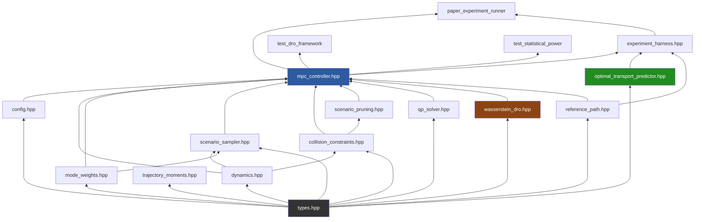

</details>

### Key Integration Points

1. **DRO -> Sampling**: DRO produces worst-case weights Q* which replace nominal weights in `sample_scenarios_with_weights()`. Obstacles with empty nominal weights (cold start) are skipped by DRO and get stationary trajectories downstream.

2. **Safe Horizon -> MPCC Cost**: When SH is active, `cost_horizon = N_safe` is passed through `solve_optimization()` -> `solve_optimization_sqp()` -> `build_condensed_qp()`. The QP limits MPCC costs to `N_mpcc = min(cost_horizon, N)` and reduces velocity tracking to 10% beyond `N_mpcc`.

3. **Reference Path -> QP**: The reference path is queried at each SQP reference state to compute contouring/lag error vectors. These are linearized into Hessian terms `N_c^T N_c` and gradient terms `N_c^T e_c_ref` in the condensed QP.

4. **Constraint -> QP Mapping**: Each `CollisionConstraint` (halfplane `a^T p >= b`) is mapped to decision variable space via position sensitivity matrices: `C[i,:] = a^T P_all[k]`, `d[i] = b - a^T p_ref[k]`.

5. **OT Predictor -> Experiment**: The OT predictor runs alongside the controller in experiments. It observes obstacle positions, builds empirical distributions, and provides OT-based mode weights as an alternative to frequency/recency weights.

---

## 8. Experiment Coverage

28 experiments (A-Z, AA, AB) spanning five categories of validation.

<details>
<summary><b>Click to expand: Experiment Category Map</b></summary>

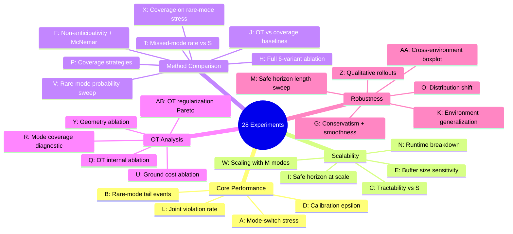

</details>

<details>
<summary><b>Click to expand: Full Experiment Details Table</b></summary>

| ID | Name | Sweeps | Variants | Rollouts | CSV Output |
|---|---|---|---|---|---|
| **A** | Mode-switch stress | switch_prob: 0.05-0.5 | Base, DRO, OT, OT+SH | 120/config | `fig1_mode_switch_stress.csv` |
| **B** | Rare-mode tail events | rare_fraction: 0.05-0.3 | Base, DRO, OT, OT+SH | 120/config | `fig2_rare_mode_tail.csv` |
| **C** | Tractability | S: 5-100 | Base, DRO | 50/config | `fig3_tractability.csv` |
| **D** | Calibration | epsilon: 0.01-0.2 | Base+enforce | 200/config | `fig4_calibration.csv` |
| **E** | Buffer sensitivity | buffer: 5-200 | Base, OT | 100/config | `fig5_buffer_sensitivity.csv` |
| **F** | McNemar paired test | - | Base vs DRO, Base vs OT+SH | 500 pairs | `fig6_mcnemar.csv` |
| **G** | Conservatism | - | Base, DRO, OT, OT+SH | 200/variant | `fig7_conservatism.csv` |
| **H** | Full ablation | - | 6 variants | 300/variant | `fig8_ablation_matrix.csv` |
| **I** | SH at scale | S: 5-60 | Base, +SH | 100/config | `fig_safe_horizon_scale.csv` |
| **J** | OT vs baselines | - | OT, Uniform, Freq, Oracle | 200/variant | `fig_ot_vs_baselines.csv` |
| **K** | Env generalization | 3 environments | Base, OT+SH | 150/config | `fig_env_generalization.csv` |
| **L** | Violation rate | S: 5-50 | Base+enforce | 200/config | `fig_violation_rate.csv` |
| **M** | SH length sweep | N_safe: 4-20 | OT+SH | 150/config | `fig_sh_length_sweep.csv` |
| **N** | Runtime breakdown | S: 5-60 | Base, DRO | 30/config | `fig_runtime_breakdown.csv` |
| **O** | Distribution shift | mismatch: 0-1 | Base, DRO, OT | 150/config | `fig_dist_shift.csv` |
| **P** | Coverage strategies | - | Oracle, Quota, OT | 200/variant | `fig_coverage_strategies.csv` |
| **Q** | OT internal ablation | epsilon, buffer | OT variants | 150/config | `fig_ot_internal_ablation.csv` |
| **R** | Coverage diagnostic | - | Base, OT, Coverage | 100/variant | `fig_mode_coverage_diagnostic.csv` |
| **T** | Missed-mode vs S | S: 5-40 | Base, OT, OT+SH | 200/config | `fig_missed_mode_vs_S.csv` |
| **U** | Ground cost ablation | 7 cost types | OT variants | 150/variant | `fig_ground_cost_ablation.csv` |
| **V** | Rare-mode sweep | rare_p: 0.05-0.3 | Base, DRO, OT, OT+SH | 300/config | `fig_rare_mode_sweep.csv` |
| **W** | Scaling with M | M: 3-8 | Base, OT, OT+SH | 200/config | `fig_scaling_M_modes.csv` |
| **X** | Coverage rare-mode | rare_p: 0.05-0.3 | Coverage, OT, OT+SH | 200/config | `fig_coverage_rare_mode.csv` |
| **Y** | Geometry ablation | 4 geometry types | OT variants | 150/variant | `fig_geometry_ablation.csv` |
| **Z** | Qualitative rollouts | - | Base, OT+SH | 20/variant | `fig_qualitative_rollouts.csv` |
| **AA** | Robustness boxplot | 3 environments | Base, DRO, OT, OT+SH | 200/config | `fig_robustness_boxplot.csv` |
| **AB** | OT Pareto frontier | epsilon: 0.01-1.0 | OT | 150/config | `fig_ot_pareto.csv` |

</details>

<details>
<summary><b>Click to expand: Metrics Collected Per Rollout</b></summary>

| Metric | Type | Description |
|---|---|---|
| `collision` | bool | Did ego collide with obstacle? |
| `min_clearance` | double | Minimum distance to any obstacle |
| `total_progress` | double | Path fraction completed [0, 1] |
| `control_effort` | double | $\sum(a^2 + \delta^2)$ |
| `avg_solve_ms` | double | Mean MPC solve time |
| `p95_solve_ms` | double | 95th percentile solve time |
| `missed_mode_steps` | int | Steps where true mode not sampled |
| `avg_safe_horizon` | double | Mean truncated horizon length |
| `clearance_5pct` | double | 5th percentile clearance |
| `missed_mode_rate` | double | Fraction of steps with missed modes |

</details>

### Statistical Tests Used

| Test | Where | Purpose |
|---|---|---|
| Wilson CI | All experiments | Confidence interval for collision rate |
| McNemar chi-squared | Exp F, test_statistical_power | Paired significance for collision rate difference |
| Bootstrap CI | Exp F | Paired delta with 10,000 resamples |
| Cohen's h | test_statistical_power | Effect size for proportion differences |
| Permutation test | test_statistical_power | Non-parametric significance for missed-mode rate |
| Binomial test | test_statistical_power | One-sided exceedance of epsilon bound |

### Hypothesis Test Binaries

<details>
<summary><b>Click to expand: test_dro_framework Hypotheses (H1-H6)</b></summary>

| Test | Goal | Rollouts | Statistical Method | CSV |
|---|---|---|---|---|
| **H1** | DRO always covers rare mode without scaling S | 600/S at S={5,10,20,40} | Mode coverage rate comparison | `exp_h1_mode_coverage.csv` |
| **H2** | DRO reduces collision rate | 600/S at S={10,20,40} | McNemar paired test | `exp_h2_collision_reduction.csv` |
| **H3** | Safe horizon truncation enforces epsilon guarantee | 600/S at S={20,40,80} | Theoretical bound verification | `exp_h3_safe_horizon.csv` |
| **H4** | Multi-disc D=3 vs D=1 improvement | 600 per D | Collision rate + clearance | `exp_h4_multi_disc.csv` |
| **H5** | Full ablation matrix + McNemar significance | 600/variant (5 variants) | Pairwise McNemar chi-squared | `exp_h5_ablation_table.csv` |
| **H6** | W2 Bures ground cost captures mode geometry | Analytic | Transport cost matrix symmetry, Q* validity | `exp_h6_ground_cost_matrix.csv` |

</details>

<details>
<summary><b>Click to expand: test_statistical_power Hypotheses (H1-H4)</b></summary>

Constants: `H1_ROLLOUTS=2000`, `H2_ROLLOUTS=1500`, `H4_ROLLOUTS=1500`, `BOOTSTRAP_RESAMPLES=10000`, `PERMUTATION_ITERS=5000`

| Test | Goal | Rollouts | Statistical Methods | CSV |
|---|---|---|---|---|
| **H1** | High-power paired collision test | 2000 paired (4 variants) | McNemar, z-test, Cohen's h, Bootstrap CI | `exp_h1_paired_high_power.csv` |
| **H2** | Missed-mode significance | 1500/variant at switch_prob={0.2,0.3,0.5} | z-test, Cohen's h, Permutation test (5000 shuffles) | `exp_h2_missed_mode_significance.csv` |
| **H3** | Epsilon-bound exceedance | Reuses H1 data | One-sided binomial with continuity correction | `exp_h3_epsilon_exceedance.csv` |
| **H4** | Increased-power ablation table | 1500/variant | Wilson CI, all metrics | `exp_h4_ablation_table_1000.csv` |

Variants tested: BASE (Frequency, no DRO), DRO_ONLY (Frequency + DRO), OT_ONLY (Wasserstein weights, no DRO), OT_PLUS_DRO (Wasserstein + DRO).

</details>

---

## 9. Python Reference Comparison (PyMPC)

The reference Python implementation lives at `/home/stephen/PyMPC`. This section documents the verification that the C++ codebase faithfully implements the same algorithms.

### 9.1 Module Mapping

| Python Module | C++ Equivalent | Status |
|---|---|---|
| `scenario_mpc/dynamics.py` | `dynamics.hpp/cpp` | **EXACT MATCH** |
| `scenario_mpc/collision_constraints.py` | `collision_constraints.hpp/cpp` | **EXACT MATCH** |
| `scenario_mpc/mode_weights.py` | `mode_weights.hpp/cpp` | **MATCH** (C++ adds 3 extra weight types) |
| `scenario_mpc/scenario_sampler.py` | `scenario_sampler.hpp/cpp` | **MATCH** (C++ adds stationary fallback) |
| `scenario_mpc/scenario_pruning.py` | `scenario_pruning.hpp/cpp` | **MATCH** |
| `scenario_mpc/solver.py` | `qp_solver.hpp/cpp` + SQP in mpc_controller | **MATCH** (different solver backend) |
| `scenario_mpc/config.py` | `config.hpp` | **MATCH** (C++ adds MPCC/SH/DRO params) |
| `scenario_mpc/mpc_controller.py` | `mpc_controller.hpp/cpp` | **MATCH** |
| `modules/objectives/contouring_objective.py` | inline in `build_condensed_qp()` | **MATCH** |
| `modules/constraints/safe_horizon_constraint.py` | `config.hpp:compute_safe_horizon()` | **MATCH** |
| `planning/types_impl.py:ReferencePath` | `reference_path.hpp/cpp` | **MATCH** |

### 9.2 Verified Formulations

**Ego Dynamics**: Both use identical unicycle model `dx/dt = [v*cos(theta), v*sin(theta), w, a]` with RK4 integration. Jacobians `(A, B)` computed identically.

**Obstacle Mode Models**: All six modes (constant_velocity, decelerating, turn_left, turn_right, lane_change_left, lane_change_right) have identical A, b, and G matrices. Process noise scaling `G *= 0.5` matches.

**Collision Constraints (Eqs. 17-18)**: Direction vector `a = (p_ego - p_obs) / ||p_ego - p_obs||`, constraint `a^T p_ego >= a^T p_obs + r_combined`. Degenerate handling (`dist < 1e-6 => a = [1,0]`) matches. Multi-disc placement identical.

**Mode Weights (Eqs. 4-6)**: UNIFORM, RECENCY, FREQUENCY strategies are identical. C++ extends with WASSERSTEIN (30% freq + 70% recency), TEMPERATURE (T=0.5 sharpening), EPSILON_GREEDY (eps=0.3).

**Config Defaults**: All shared parameters match: `horizon=20, dt=0.1, ego_radius=1.0, max_acceleration=3.0, min_acceleration=-5.0, max_steering_rate=0.8, obstacle_radius=0.5, num_scenarios=10, confidence_level=0.95, beta=0.01, goal_weight=10.0, velocity_weight=1.0, acceleration_weight=0.1, steering_weight=0.1, safety_margin=0.1`.

### 9.3 Intentional Differences

**Solver Backend**: Python uses CasADi/IPOPT (nonlinear, NLP formulation). C++ uses SQP + ADMM QP (linearized, condensed QP formulation). Both solve the same underlying problem but C++ is faster for real-time use.

**Progress Variable `s`**: Python uses a 5D state `[x, y, psi, v, s]` where the spline progress `s` is an algebraic (not integrated) state variable updated via closest-point projection inside CasADi. C++ uses a 4D state `[x, y, theta, v]` and computes `s` externally via `reference_path::find_closest_point()` at each SQP iteration. Both approaches converge to the same result -- C++ re-projects at each SQP iteration, which is equivalent to the NLP formulation in the limit.

**Contouring Error Sign Convention**: Python computes `contour_error = dy_norm*(x-path_x) - dx_norm*(y-path_y)`. C++ computes `e_c = n_ref.dot(pos - path_pos)` where `n_ref = [-sin(h), cos(h)]`. These are negatives of each other (`e_c_cpp = -contour_error_py`), but since both are squared in the cost, the optimization is identical.

**Lag Error Sign Convention**: Python `lag_error = dx_norm*(x-path_x) + dy_norm*(y-path_y)` (positive = ahead). C++ `e_l = -t_ref.dot(pos - path_pos)` (positive = behind). Same negation, same squaring, same optimization.

**Terminal Goal Multiplier**: Python uses 10x for terminal goal cost. C++ uses 2x but adds progress-aware scaling (up to 6x near path end).

**Control Smoothness**: Python has explicit jerk penalty `0.01 * (u[k+1]-u[k])^2`. C++ uses Hessian regularization (`1e-6 * I`) instead.

**Cold-Start Handling**: Python skips obstacles with no mode history (`continue`). C++ generates a stationary hold-position trajectory, preserving collision constraints for unobserved obstacles.

**Dominance Pruning Direction (Algorithm 3)**: The Python `_scenario_dominates(s1, s2)` returns True when s1's obstacles are farther from ego (s1 is "safer"), then prunes the dominated scenario s2. This prunes the MORE constraining scenario. The C++ `scenario_dominates(s1, s2)` returns True when s1's obstacles are closer (s1 is more constraining), then prunes s2. This prunes the LESS constraining scenario. The C++ implementation is correct: in scenario-based robust optimization, redundant (less constraining) scenarios should be pruned because their constraints are automatically satisfied when harder constraints are satisfied.

**C++-Only Features**: Wasserstein DRO (Kantorovich dual), three safe horizon modes (PRACTICAL/THEORETICAL_SIMPLE/THEORETICAL_TIGHT), certificate-based constraint tightening, scenario compiler, runtime assurance, adaptive DRO shift detection.

---

## 10. Build & Execution

**Requirements**: C++17, Eigen3, CMake >= 3.14

```bash
# Build
cmake -S . -B build && cmake --build build

# Run all 28 experiments
./build/paper_experiment_runner

# Run specific experiment
./build/paper_experiment_runner V    # Rare-mode sweep

# Run DRO hypothesis tests
./build/test_dro_framework

# Run high-power statistical tests
./build/test_statistical_power
```

<details>
<summary><b>Click to expand: Build Targets</b></summary>

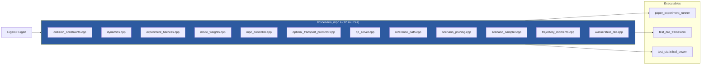

</details>

**Output**: All experiment CSVs are written to `paper_figures/` directory (created automatically).

---

*Generated for the OT-SHMPCC codebase. All diagrams are Mermaid-based and render as clickable expandable sections on GitHub and compatible Markdown viewers.*
